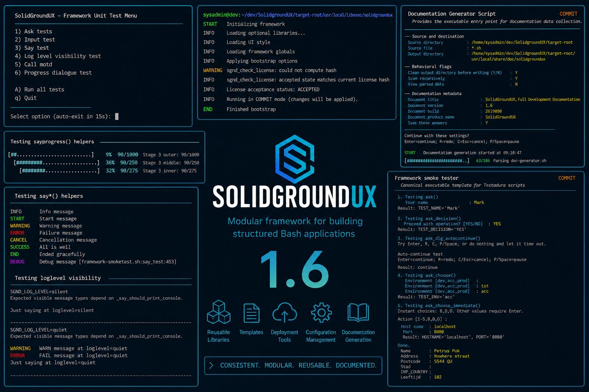
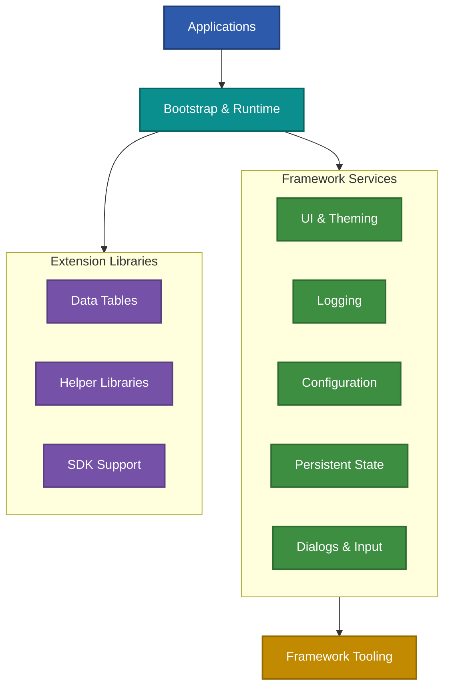
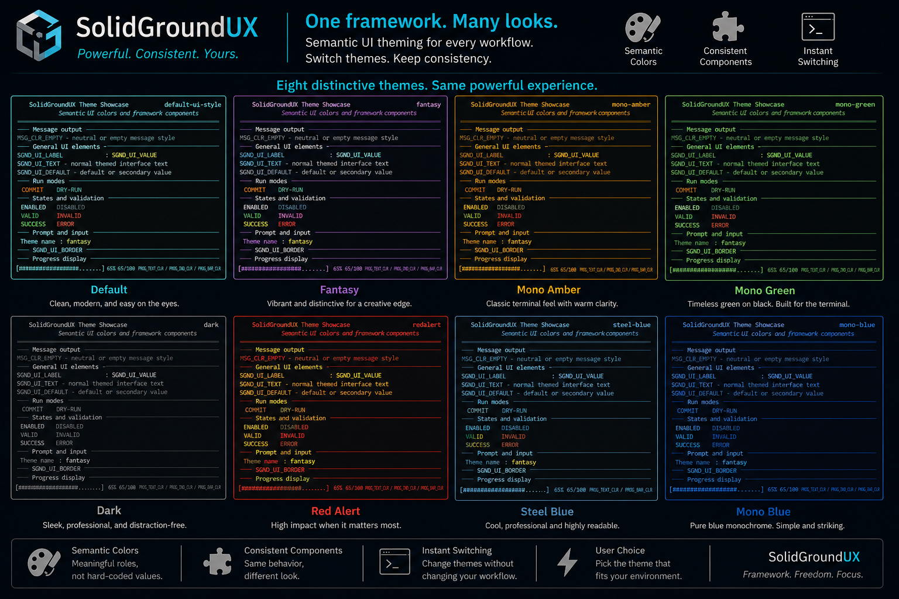
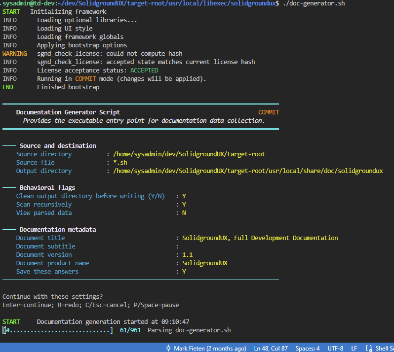
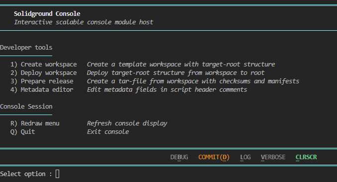

# SolidGroundUX

<table>
<tr>
<td width="170" align="center" valign="middle">
  
</td>
<td valign="middle">
  <em>Help me...</em> 

  ## Treat Bash applications like software projects.

  <em>...but get out of my way.</em>
</td>
</tr>
</table>

<table>
<tr>
<td width="25%" align="center">
  <a href="https://testadura-consultancy.github.io/SolidgroundUX/"><strong>Documentation</strong></a> 
  Framework reference and guides
</td>
<td width="25%" align="center">
  <a href="INSTALL.md"><strong>Installation</strong></a> 
  Install, upgrade and deploy
</td>
<td width="25%" align="center">
  <a href="CHANGELOG.md"><strong>Changelog</strong></a> 
  Releases and development history
</td>
<td width="25%" align="center">
  <a href="LICENSE"><strong>License</strong></a> 
  Terms of use and redistribution
</td>
</tr>
</table>

---

## What is SolidGroundUX?

The best way to understand SolidGroundUX is not by looking at its features, but by understanding why it came to be.

SolidGroundUX evolved from the observation that many aspects of application development are not unique to a single project. Configuration, logging, user interaction, state management, deployment and documentation are recurring concerns. Once these problems have been solved well, they should become reusable rather than repeatedly reimplemented.

Instead of treating Bash scripts as isolated utilities, SolidGroundUX treats them as software projects. By providing a common runtime, shared services and consistent conventions, applications become easier to understand, maintain and extend, while developers remain free to focus on the problem their application is meant to solve.

The framework does not attempt to hide Bash or prescribe a pattern merely because it is fashionable. It provides practical building blocks where they add value and stays out of the way where they do not.

## CPRP: the design principles

Every design decision in SolidGroundUX is evaluated against four principles:

- **Consistency** — Similar problems deserve similar solutions.
- **Predictability** — Software should behave as developers expect.
- **Readability** — Code is read far more often than it is written.
- **Pragmatism** — Abstractions and patterns should earn their place by adding value.

SolidGroundUX is opinionated enough to provide a dependable way of doing things, but pragmatic enough not to insist that every possible factory must become a factory or every list of choices must become an enumeration.

## See it in action

A consistent runtime, semantic UI, integrated documentation, deployment tooling and reusable libraries working together as a single framework.

Most shell scripts start small. Over time, they accumulate argument parsing, configuration loading, state management, logging, menus, prompts, validation and deployment logic—often implemented slightly differently in every project.

SolidGroundUX provides a common foundation for those recurring concerns. The result is less repetitive infrastructure code, more predictable behaviour and applications that remain understandable as they grow.

  

  

## Framework Architecture

The following sections describe the major architectural building blocks shown above and explain how they work together to provide a consistent application runtime.

---

# Framework Components

## Bootstrap and Runtime

The bootstrap system provides:

- Environment discovery
- Framework path resolution
- Library loading
- Configuration initialization
- State initialization
- Runtime metadata

Applications start with a predictable runtime environment and a common execution model.

## Command-Line Processing

Built-in support for:

- Standardized help generation
- Short and long options
- Flags
- Value arguments
- Enumerations
- Validation
- Usage examples

Argument definitions are declared as metadata rather than manually parsed.

## Configuration Management

Supports:

- System configuration
- User configuration
- Script-specific configuration
- Automatic configuration loading
- Configuration persistence

Configuration values can be integrated directly into application startup.

## Persistent State

State variables allow applications to remember values between executions.

Typical uses include:

- Previous user selections
- Last-used directories
- Runtime preferences
- Wizard-style workflows

When enabled, state variables are automatically loaded and saved by the framework.

## User Interface Services

SolidGroundUX provides reusable terminal interaction helpers including:

- Information messages
- Warnings and errors
- Input prompts
- Selection dialogs
- Form-style input
- Auto-continue dialogs
- Consistent formatting

The framework also includes semantic colours, switchable themes, styles and glyphs for building readable terminal applications without coupling application behaviour to hard-coded presentation values.

  

## Data Tables

The datatable library provides utilities for working with schema-based pipe-separated datasets.

## Documentation Generation

Documentation is extracted directly from source code and rendered as a navigable HTML documentation set.

  

## Deployment

SolidGroundUX includes deployment tooling for:

- Workspace creation
- Workspace deployment
- Release packaging
- Installation
- Upgrades
- Uninstallation

## Modular Console Applications

Applications can be composed from independent console modules and loaded by a shared interactive host.

  

---

# Included Tools

| Tool | Purpose |
|---|---|
| `create-workspace` | Create a framework-oriented development workspace |
| `deploy-workspace` | Deploy or undeploy workspace content |
| `prepare-release` | Build release packages and manifests |
| `sgnd-install` | Install or upgrade a release |
| `sgnd-uninstall` | Remove an installed release |
| `doc-generator` | Generate framework documentation |
| `sgnd-console` | Host interactive console modules |

---

# Intended Audience

SolidGroundUX is intended for developers and system administrators who:

- Build more than a handful of shell scripts
- Prefer reusable infrastructure over copy-and-paste development
- Want a consistent application structure
- Value documentation, readability and maintainability
- Need deployment and packaging support without adopting a larger runtime or language ecosystem
