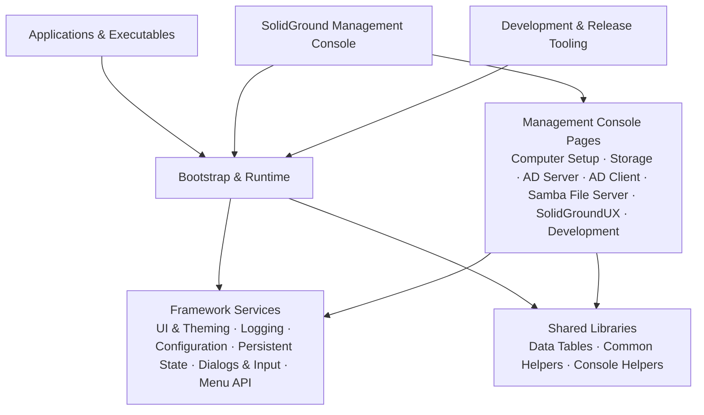
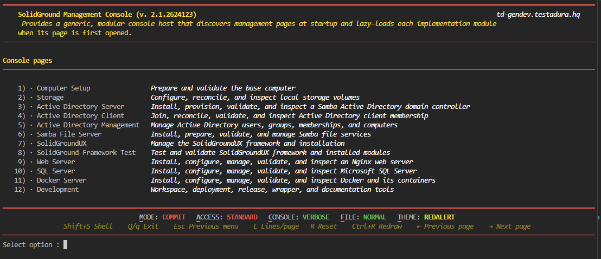
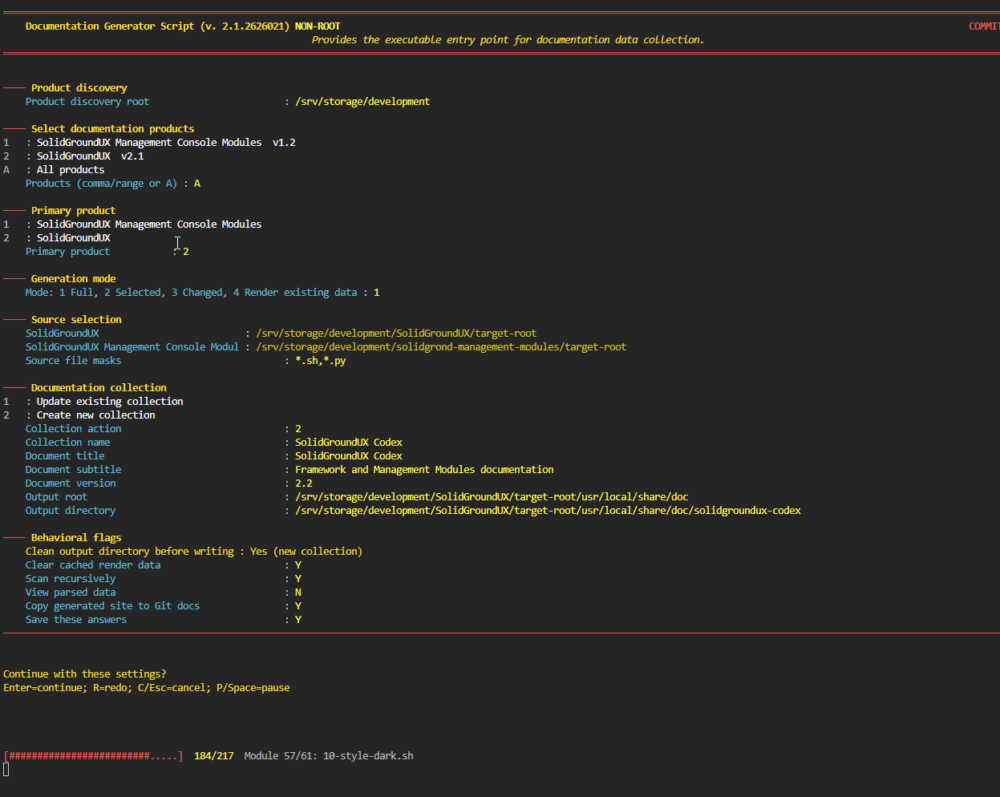

# SolidGroundUX

<table>
<tr>
<td width="170" align="center" valign="middle">
  
</td>
<td valign="middle">
  <em>Help me...</em><br>

  ## Treat Bash applications like software projects.

  <em>...but get out of my way.</em>
</td>
</tr>
</table>

<table>
<tr>
<td width="25%" align="center">
  <a href="docs/index.html"><strong>Documentation</strong></a><br>
  Framework reference and guides
</td>
<td width="25%" align="center">
  <a href="INSTALL.md"><strong>Installation</strong></a><br>
  Installation and release management
</td>
<td width="25%" align="center">
  <a href="CHANGELOG.md"><strong>Changelog</strong></a><br>
  Releases and development history
</td>
<td width="25%" align="center">
  <a href="LICENSE"><strong>License</strong></a><br>
  Terms of use and redistribution
</td>
</tr>
</table>

---

## What is SolidGroundUX?

The best way to understand SolidGroundUX is not by looking at its features, but by understanding why it came to be.

SolidGroundUX evolved from the observation that many aspects of application development are not unique to a single project. Configuration, logging, user interaction, state management, deployment and documentation are recurring concerns. Once these problems have been solved well, they should become reusable rather than repeatedly reimplemented.

Instead of treating Bash scripts as isolated utilities, SolidGroundUX treats them as software projects. By providing a common runtime, shared services and consistent conventions, applications become easier to understand, maintain and extend, while developers remain free to focus on the problem their application is meant to solve.

The framework does not attempt to hide Bash or prescribe a pattern merely because it is fashionable. It provides practical building blocks where they add value and stays out of the way where they do not.

SolidGroundUX has since grown beyond the framework itself. It now combines that application framework with development and release tooling and a modular Linux management environment. The same framework primitives used by standalone applications are reused by the SolidGround Management Console rather than being reimplemented specifically for administration.

## CPRP: the design principles

Every design decision in SolidGroundUX is evaluated against four principles:

- **Consistency** — Similar problems deserve similar solutions.
- **Predictability** — Software should behave as developers expect.
- **Readability** — Code is read far more often than it is written.
- **Pragmatism** — Abstractions and patterns should earn their place by adding value.

SolidGroundUX is opinionated enough to provide a dependable way of doing things, but pragmatic enough not to insist that every possible factory must become a factory or every list of choices must become an enumeration.

## See it in action

A consistent runtime, semantic UI, integrated documentation, deployment tooling, release management and reusable libraries working together as a single framework.

Most shell scripts start small. Over time, they accumulate argument parsing, configuration loading, state management, logging, menus, prompts, validation and deployment logic—often implemented slightly differently in every project.

SolidGroundUX provides a common foundation for those recurring concerns. The result is less repetitive infrastructure code, more predictable behaviour and applications that remain understandable as they grow.

<p align="center">
  
</p>

<br><br>

## Architecture

SolidGroundUX is organized around a small common runtime rather than a collection of unrelated utilities.


```mermaid
flowchart TB

    APP["Applications & Executables"]
    CONSOLE["SolidGround Management Console"]
    TOOLING["Development & Release Tooling"]

    RUNTIME["Bootstrap & Runtime"]

    SERVICES["Framework Services<br/>UI & Theming · Logging · Configuration · Persistent State · Dialogs & Input · Menu API"]
    LIBS["Shared Libraries<br/>Data Tables · Common Helpers · Console Helpers"]
    PAGES["Management Console Pages<br/>Computer Setup · Storage · AD Server · AD Client · Samba File Server · SolidGroundUX · Development"]

    APP --> RUNTIME
    CONSOLE --> RUNTIME
    TOOLING --> RUNTIME

    RUNTIME --> SERVICES
    RUNTIME --> LIBS

    CONSOLE --> PAGES
    PAGES --> SERVICES
    PAGES --> LIBS
```

The framework supplies the common execution environment. Applications and tools opt into the services they need, while the Management Console uses the same public framework APIs to assemble a larger interactive application.

---

# Framework Runtime

## Bootstrap and execution

Executable scripts explicitly bootstrap into SolidGroundUX. The bootstrap layer provides a predictable runtime environment including:

- Framework and application root discovery
- Runtime path construction
- Library loading through `SGND_USING`
- Script metadata
- Argument processing
- Configuration initialization
- Persistent state initialization
- UI and logging initialization

Applications therefore start from a common execution model instead of recreating their own startup infrastructure.

## Command-line processing

SolidGroundUX provides declarative argument handling for:

- Long and short options
- Flags
- Value arguments
- Enumerated choices
- Validation
- Generated help
- Usage examples
- Framework-provided built-in arguments

Arguments are described as metadata and processed by the framework rather than manually parsed in each executable.

## Configuration

Configuration supports system-wide, user-specific and application-specific values.

The framework resolves the applicable configuration during startup and makes the effective settings available to the application. This allows scripts to use persistent configuration without embedding configuration-file parsing throughout their implementation.

## Persistent state

State is intended for values that belong to an execution workflow rather than permanent configuration.

Typical uses include:

- Previous user selections
- Last-used paths
- Console preferences
- Incremental deployment timestamps
- Wizard and workflow values

Scripts declare the state they want to persist; the framework handles loading and saving it.

## Logging

SolidGroundUX provides semantic message functions and independently configurable console and file logging.

Applications can emit messages according to meaning—information, warning, failure, success, debug and related states—without deciding presentation at every call site.

Console and file log levels are controlled independently, allowing interactive output to remain quiet while retaining more detailed diagnostic logging when required.

## Terminal UI and dialogs

The UI layer provides reusable terminal primitives for:

- Titles and section headers
- Labels and values
- Wrapped and aligned text
- Semantic colours
- Themes
- Glyphs
- Input prompts
- Decisions and selections
- Form-style input
- Date/time input
- Auto-continue dialogs
- Progress indicators

Presentation is separated from application logic wherever doing so adds practical value.

<p align="center">
  
</p>

## Menu API

`sgnd-menu.sh` provides the reusable public menu API used by the Management Console and standalone framework tools.

Consumers can create a menu, register groups and items, render the current page, read or dispatch selections, and control optional console chrome without implementing their own menu model.

This is deliberately separate from the SolidGround Management Console itself: the console is a consumer of the menu framework, not the definition of it.

## Data tables

The datatable library provides schema-based operations for pipe-separated datasets and is used internally where structured shell data is preferable to parallel ad-hoc arrays.

## Shared libraries

Reusable functionality lives in common libraries rather than being copied between applications or console modules.

A useful distinction has evolved within the framework naming convention:

- `sgnd_*` — public framework API intended for consumers.
- `_sgnd_*` — framework-internal API available to cooperating SolidGroundUX libraries and components.
- `_foo` — local implementation detail belonging to a particular script or module.

Bash cannot enforce these access levels, but the convention makes intended ownership clear.

---

# SolidGround Management Console

The SolidGround Management Console is a modular administration application built on the SolidGroundUX runtime and public menu API.

It is intended to provide a consistent interface for common Linux system-management tasks while delegating substantial workflows to reusable framework libraries and executables.

<p align="center">
  
</p>

## Index-based navigation

The console starts with a lightweight main index.

At startup it discovers the available console pages and reads their lightweight metadata, but does not immediately source every implementation module.

When a page is selected:

1. Its module is sourced.
2. The module registers its detailed groups and actions.
3. The selected page is rendered.
4. The module remains loaded for the rest of the console process.

Returning to the index does not unload the page.

This keeps initial console startup lightweight while avoiding repeated loading once functionality has been used.

## Page visibility

Console pages can be enabled or disabled through persistent visibility state.

When running as root, the index exposes **Manage visibility** (`V`). Changes are stored in the existing console-module state and the index is rebuilt immediately.

Visibility is therefore part of the console environment rather than hard-coded into the host.

## Direct controls

Frequently used runtime controls are available directly from the console instead of requiring a separate settings page.

These include controls for such things as:

- Dry-run or commit mode
- Access context
- Console logging
- File logging
- Theme
- Lines per page
- Redraw
- Interactive shell access

The exact available controls are shown by the console itself.

## Management pages

The current console is organized around functional pages including:

### Computer Setup

Base-machine preparation and configuration, including machine identity, networking, SSH, package management and template preparation.

### Storage

Local storage provisioning and inspection, including filesystem creation, persistent mounting, expansion, validation, status, ownership and permissions.

### Active Directory Server

Samba Active Directory server installation, provisioning, validation, status and directory-management functions.

### Active Directory Client

Domain-client installation, join/leave workflows, membership status and related DNS integration.

### Samba File Server

Samba file-server installation, validation and managed-share administration.

### SolidGroundUX

Framework information and maintenance, including configuration, state, logging, diagnostics and access to the Release Manager.

### Development

Workspace, deployment, release preparation, wrapper creation, documentation and other SolidGroundUX development workflows.

The page structure can evolve without requiring the console host itself to become a monolithic administration script.

---

# Development Tooling

SolidGroundUX includes tools for building and maintaining applications that use the framework.

## Workspaces

`create-workspace` creates a repository-shaped development workspace and copies the canonical SolidGroundUX templates into it.

`deploy-workspace` deploys complete or filtered workspace content locally or remotely. It supports incremental deployment and can select content by filename or mask and modification time.

## Documentation generation

`doc-generator` extracts structured documentation from source comments and renders a navigable HTML documentation set.

Documentation therefore remains close to the code it describes rather than becoming an unrelated document that must be maintained independently.

<p align="center">
  
</p>

## Release preparation

`prepare-release` turns a development tree into a prepared SolidGroundUX release.

Its responsibilities include release metadata maintenance, checksums, manifests, removed-file tracking, executable permissions, wrapper verification and creation of the final release artifacts.

The resulting release package is intended to be consumed by `release-manager`.

---

# Installation and Release Management

SolidGroundUX uses `release-manager.sh` as the canonical installation and release-lifecycle tool.

The previous separate installer, updater and uninstaller architecture has been superseded.

A normal release flow is:

```text
Development workspace
        |
        v
prepare-release
        |
        v
Prepared release artifacts
        |
        v
release-manager
        |
        +--> install
        +--> update
        +--> rollback / reinstall
        +--> remove
```

## Filesystem-based release state

Release state is represented by the release artifacts themselves rather than a separate current-version database.

The release manager uses:

```text
/var/lib/solidgroundux/releases
/var/lib/solidgroundux/archive
```

Available releases are kept beneath `releases/`. Installed release history is retained beneath `archive/`, where the highest archived release represents the currently installed release.

This makes the release lifecycle inspectable using ordinary filesystem tools.

## Bootstrap installation

A release bundle can include both the prepared release and `release-manager.sh`.

On a fresh machine, the bundle can be extracted into a temporary location and the bundled release manager executed. It establishes the canonical release-management directories, installs itself into its managed location, validates the accompanying release and proceeds through the normal installation path.

The bootstrap path therefore converges on the same release model used for subsequent updates and rollbacks.

---

# Conventions and Extensibility

SolidGroundUX favors convention over repeated configuration.

Executable scripts, source-only libraries and Management Console modules each follow recognizable structures. Shared behavior is moved into common libraries when multiple independent consumers need it.

In particular, lazy-loaded console modules must not depend on another page having been opened first. Functionality genuinely shared between modules belongs in a common library such as `console-helpers.sh` or another appropriately scoped library.

This keeps page modules focused on registration and subject-specific behavior while preserving predictable dependencies.

---

# Included Tools

| Tool | Purpose |
|---|---|
| `sgnd-console` | Run the SolidGround Management Console |
| `create-workspace` | Create a framework-oriented development workspace |
| `deploy-workspace` | Deploy complete or filtered workspace content locally or remotely |
| `prepare-release` | Prepare release archives, manifests, checksums and metadata |
| `release-manager` | Install, update, rollback, reinstall or remove SolidGroundUX releases |
| `create-wrappers` | Create public command wrappers for SolidGroundUX executables |
| `doc-generator` | Generate the HTML framework documentation |
| `framework-smoketest` | Exercise core framework APIs and runtime behaviour |

---

# Intended Audience

SolidGroundUX is intended for developers and system administrators who:

- Build more than a handful of shell scripts
- Prefer reusable infrastructure over copy-and-paste development
- Want a consistent application structure
- Value documentation, readability and maintainability
- Need deployment and release tooling without adopting a larger runtime
- Want common Linux administration workflows presented through a consistent interface
- Prefer software that remains understandable and inspectable rather than hiding behaviour behind unnecessary abstraction

SolidGroundUX does not try to turn Bash into another language.

It tries to provide enough solid ground beneath Bash applications that they can be treated like software.
