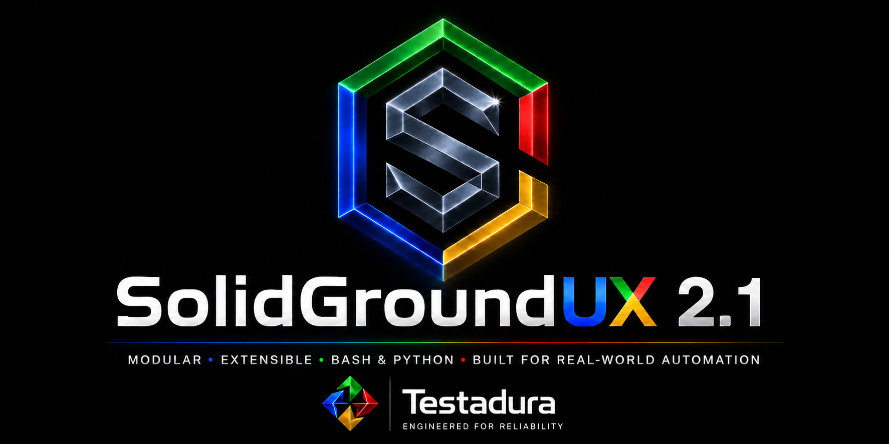

# SolidGroundUX 2.0 Release Notes

**Version 2.0 — Build 2.0.2623316**

> **Modular • Extensible • Bash & Python • Built for real-world automation**

SolidGroundUX 2.0 is a major architectural release that consolidates the framework, Management Console, system-administration tools, development workflow, documentation, deployment, and release management into a coherent and reusable platform. The final 2.0 work also sharpens the console interaction model, adds repository synchronization, and turns the runtime theme specimen into a practical showcase of the framework UI.

## Highlights

### Lightweight, modular Management Console

The SolidGround Management Console has been redesigned around a lightweight main index and lazy-loaded pages.

At startup, the console discovers available pages without sourcing their full implementation modules. A page is loaded only when it is opened for the first time and remains resident for the rest of the console session. This reduces initial startup work while avoiding repeated loading once functionality has been used.

Root users can manage page visibility directly from the index.

### Reworked for reuse

The menu system has evolved into reusable framework infrastructure rather than functionality owned by the Management Console.

The public menu API now includes `sgnd_menu_dispatch`, allowing standalone SolidGroundUX applications and tools to register, render, read, and dispatch menu actions through the same framework API. `framework-smoketest.sh` now uses this public API as a standalone consumer.

Shared console-internal functionality used by multiple modules has moved into `lib/common/console-helpers.sh`, preventing lazy-loaded pages from depending on another page having already been opened.

### Truecolor and dynamic-width UI

The default UI palette now uses explicit 24-bit truecolor values rather than terminal-defined ANSI colors, giving SolidGroundUX a more consistent appearance across terminals.

UI primitives now share the same dynamic-width behavior. They can use the full terminal width by default while `SGND_MAX_RENDER_WIDTH` remains available as an optional explicit cap.

Paging, legends, post-action behavior, and console navigation have also been refined.

### Documentation pipeline

The documentation system now supports a deeper but still deliberately bounded hierarchy: **Group → optional Subgroup → Module**. This allows related tooling such as the Documentation Generator components to be collected under one SDK group without flattening everything into a single level.

Source selection accepts comma-separated masks and defaults to `*.sh,*.py`, so Bash and Python modules follow the same collection path. The documentation comment dialect is shared across both languages, including `fn:`, `var:`, `doc:`, and the new `cls:` marker for Python classes.

Parsed renderer data is persisted after normal generation, enabling **Render existing data** mode to rebuild the HTML site in seconds without rescanning the complete source tree. This makes renderer, CSS, navigation, branding, and documentation-layout work dramatically faster.

The generated site has also become more self-contained and presentation-ready: it supports functional branding assets, sticky page headers, generated semantic theme specimens based on the actual style definitions, and dedicated documentation images for workflows, architecture, deployment, and other visual explanations.

### Storage and access management

Storage is now a first-class Management Console function.

SolidGroundUX can provision unused disks using GPT with EXT4 or XFS, configure persistent mounts, mount and unmount storage, expand configured storage, validate the resulting configuration, and report filesystem, capacity, mount, and health information.

Storage Access provides ownership, group, and Unix permission management for the canonical storage and share roots.

### Repository synchronization

Development repositories can now be synchronized directly from the development
server to a configured workstation or backup machine through `sync-repository.sh`.

Destination machine, user, and directory settings are persisted. Transfers are
staged remotely and replace the existing copy only after a successful transfer,
so source-side deletions and renames are reflected without first destroying the
last good destination copy. A lightweight source-tree signature allows unchanged
repositories to be skipped, while a force option remains available when a full
refresh is wanted.

### Refined console interaction

The Management Console host is now `management-console.sh`, while `sgnd-console`
remains the public command.

The main index uses the same standard control bar as loaded console pages, so
the visible keyboard legend matches the controls that are actually active.
Selection handling is also more forgiving: invalid input is reported, cleared,
and followed by a fresh selection prompt rather than disrupting the console
flow. Numeric selections are interpreted explicitly as base 10.

### Runtime theme showcase

`sgnd_style_samples` is now the canonical runtime showcase for an active theme.

Message labels are rendered directly with their corresponding `LBL_*` and
`MSG_CLR_*` semantics. The General UI Elements section demonstrates the actual
rendering primitives by name, including `sgnd_print`, `sgnd_print_single`,
`sgnd_print_labeledvalue`, `sgnd_print_labeledmultivalue`, `sgnd_print_fill`,
`sgnd_print_sectionheader`, and `sgnd_print_titlebar`.

The specimen retains the run-mode, state, validation, and progress examples,
adds a non-interactive `ask` simulation, and lists Message, Progress, and UI
semantic colors together with their resolved palette name, RGB hex value, or
indexed-color value.

## What's New in 2.0

### Management Console evolution

- Lightweight main index with lazy page loading.
- Loaded pages remain resident for the console session.
- Direct page navigation through the main index.
- Root-only **Manage visibility** control.
- Dedicated **SolidGroundUX** page for framework information, configuration, state, logging, diagnostics, and release management.
- Dedicated **Storage** and **Storage Access** functionality.
- Context-aware navigation legends.
- Added `R Reset` to clear last-run result markers on the current module page without affecting other pages; manual redraw moved to `Ctrl+R`.
- Direct quick-access controls replace the former Console Settings page.
- Normal actions provide an interruptible post-action viewing window of at least 15 seconds.
- The main index now uses the same standard bottom control bar as normal console pages.
- Invalid selections are reported and cleared before waiting for a new selection.
- Numeric menu selections are handled explicitly as base-10 values.
- Computer Setup generates SSH host keys before enabling and starting SSH.
- Restored the Computer Setup status view.
- Menu label columns automatically size to the longest visible entry on both the main index and loaded console pages.
- Yes/No prompts now use the less aggressive `Yes` / `No` presentation.
- Continue dialogs are visually separated from preceding output.
- Added dedicated Active Directory Management for users, groups, memberships, and computer accounts.
- Added an Nginx Web Server role.
- Added a Microsoft SQL Server role.
- Computer Setup, AD Server provisioning, and user and group management have now been fully tested end-to-end: from a fresh Ubuntu clone to a provisioned Active Directory server with two users and a group took approximately six minutes.
- The final file-server test covered storage provisioning, Samba preparation, managed share creation/removal, and Active Directory-backed share access from a freshly prepared NAS role.

### Final console and administration refinements

The final 2.0 stabilization pass focused on details exposed by end-to-end Management Console testing. Computer Setup now generates SSH host keys before enabling and starting SSH, and its status view has been restored. Console presentation has been tightened with consistent visible-width section headers, automatic menu label-column sizing on both the main index and normal module pages, softer `Yes` / `No` prompt styling, and consistent spacing before continue dialogs.

A new reusable `ask_selection` primitive provides single- and multi-selection from arrays and is already used by release preparation, archive restoration, Active Directory administration, and Samba share-management workflows.

Active Directory Management received a final usability pass with consistent back/quit handling, repeat-operation loops for common user/group membership actions, removal of redundant confirmations, and workflow-specific auto-continue legends. The console can also clear last-run result markers for the current page with `R Reset`; redraw is now explicitly available as `Ctrl+R`.

Active Directory administration is now available as a dedicated console module for users, groups, memberships, and computer accounts. Samba share management can assign Active Directory groups to shares, while validation no longer treats default printer shares as managed file shares.

Two additional server roles round out the initial 2.0 administration set: an Nginx Web Server role and a Microsoft SQL Server role.

SolidGroundUX also once again identifies itself at login through a lightweight `50-SolidGroundUX` MOTD. The banner reads framework identity from the canonical definitions, reports license information and acceptance state, links to the documentation, and points administrators to `sgnd-console`.

### Framework and API improvements

- Added public `sgnd_menu_dispatch`.
- Standalone tools can use the public menu renderer and dispatcher without Management Console chrome.
- `framework-smoketest.sh` now exercises the public menu API directly.
- Shared console helpers moved to `lib/common/console-helpers.sh`.
- UI rendering primitives use common dynamic-width behavior.
- `SGND_MAX_RENDER_WIDTH=0` or an unset value allows full terminal-width rendering.
- The framework smoke-test progress demonstration now uses genuinely nested progress levels.
- `sgnd_style_samples` now acts as the canonical runtime theme and UI-primitives showcase.
- Theme color specimens report the resolved palette name, RGB hex value, or indexed color.
- The theme showcase includes a non-interactive simulation of the framework ask styling.
- Added `ask_selection`, a reusable array-based selection primitive supporting single- and multi-selection.
- `prepare-release.sh` and `untar-it.sh` now use the shared selection primitive.
- Section-header and menu-label width calculations consistently use visible render width.

### Storage and Samba

- GPT storage provisioning.
- EXT4 and XFS filesystem creation.
- Persistent `/etc/fstab` configuration.
- Mount, unmount, expansion, validation, and status operations.
- Storage ownership, group, and permission management.
- Managed Samba share creation and removal.
- Dedicated interactive Samba share manager.
- Share configuration validation and rollback on invalid configuration.
- Added `manage-samba-shares.sh` for assigning Active Directory group access to managed shares.
- Samba validation excludes default printer shares such as `printers` and `print$` from managed file-share validation.
- Storage confirmation handling now honors the canonical `YES` / `NO` values returned by `ask_decision`; provisioning was verified through partitioning, filesystem creation, persistent mounting, and creation of `/srv/storage/shares`.
- Samba share creation and removal now support repeat-operation workflows, with share selection used for removal.
- Samba share management discovers Active Directory groups directly through authenticated LDAP/GSSAPI instead of relying on NSS enumeration.
- The share manager discovers the LDAP domain controller through the Active Directory SRV record, uses the canonical uppercase Kerberos realm, and disables SASL hostname canonicalization so the registered LDAP service principal is used.
- When no valid Kerberos ticket exists, the share manager prompts for an Active Directory account, obtains a ticket with `kinit`, verifies it, and continues directly to group selection.
- Selected AD groups are resolved through NSS in qualified `group@domain` form before ACL assignment.

### Active Directory and networking

- DNS server and DNS search-domain configuration are treated as a common network identity concern.
- Added Active Directory DNS-zone and host-record management.
- Domain join configures and validates the machine FQDN.
- Joined clients register their IPv4 host record in Active Directory DNS.
- Membership status now reports consolidated FQDN, address, realm, DNS, Kerberos, LDAP, and registration information.
- AD role installation explicitly includes `samba-common-bin` so `samba-tool` is a direct dependency.

### Release management

`release-manager.sh` is now the canonical SolidGroundUX installation and release-lifecycle tool.

It supports checking for and downloading releases from GitHub, installation and updates, rollback, reinstallation, removal, unattended execution, and dry-run operation.

Release state is filesystem-based:

- `/var/lib/solidgroundux/releases` contains releases available for installation.
- `/var/lib/solidgroundux/archive/<release>` contains installed release history.

Prepared release bundles are self-contained bootstrap packages and include the Release Manager required to install them on a fresh machine.

### Development and documentation tooling

- Added `sync-repository.sh` for direct development-server to workstation/backup synchronization over SSH/SCP.
- Repository synchronization persists destination settings, stages transfers safely, reflects removals and renames, and can skip unchanged source trees.
- Added `create-wrappers.sh` for generating public SolidGroundUX command wrappers.
- `prepare-release.sh` verifies executable wrappers and can create missing ones.
- Release preparation supports historical manifests when generating `.removed`.
- Version and Build updates support All, Changed, or None independently.
- Checksums are refreshed automatically for changed files.
- Workspace creation follows the repository-shaped `target-root` layout.
- `deploy-workspace.sh` provides improved remote deployment, date filtering, redo behavior, and deployment summaries.
- Documentation generation supports Full, Selected, Changed, and **Render existing data** modes.
- Source masks are comma-separated and default to `*.sh,*.py`, allowing Bash and Python modules to be documented by the same pipeline.
- The documentation model now supports one optional **Subgroup** level beneath Group, including subgroup prefaces and epilogues.
- The source documentation dialect is shared across Bash and Python. Python classes can now be documented with `cls:` while functions and methods continue to use `fn:`.
- The Python renderer itself is documented under **SDK → Documentation Generator**.
- Successful parse modes persist normalized renderer data so HTML, CSS, navigation, branding, and layout changes can be regenerated without reparsing the complete source tree.
- The renderer uses functional documentation asset names rather than brand-specific filenames, including `doc-index-logo.png`, `doc-header-logo.png`, and `doc-index-hero.png`.
- Generated documentation now includes sticky page branding so the documentation identity remains visible while scrolling.
- Semantic theme specimens are generated from the actual SolidGroundUX style and palette assignments instead of relying on manually maintained screenshots.
- Documentation images are copied into the generated site and can be referenced directly from source documentation comments, allowing ASCII workflows and architecture sketches to be replaced by richer visual figures while keeping the source documentation authoritative.
- Project-level sources such as the Canonical document, CHANGELOG, INSTALL guide, and license continue to feed the generated appendices and reference pages.

### System identity and login

- Added the lightweight `50-SolidGroundUX` dynamic MOTD.
- The MOTD reports the installed SolidGroundUX version/build, company, copyright, license, license-acceptance state, and documentation location.
- Login guidance points directly to `sgnd-console` for system management.
- Framework identity is sourced from canonical `sgnd-definitions.sh` rather than duplicated in the MOTD.
- Management Console runtime version/build metadata now follows canonical script-header metadata initialized by bootstrap, removing a separate hard-coded version/build source.

### Generated documentation experience

The generated HTML documentation is now a much more complete part of the framework rather than a passive code dump.

Navigation reflects the framework hierarchy, pages carry persistent SolidGroundUX documentation branding, the index includes publisher branding and a release hero, and visual figures can be embedded directly from the framework assets. Theme documentation can show live semantic specimens derived from the real style definitions, keeping visual documentation aligned with the source.

Renderer-only rebuilds make this presentation layer practical to iterate on without waiting for a complete documentation parse.

## Framework at a Glance

Statistics reported by the documentation generator for this release:

| Metric | Count |
| --- | ---: |
| Modules | **59** |
| Functions | **736** |
| Source lines | **44,028** |
| Code lines | **21,588** |

## Reliability and fixes

Version 2.0 also resolves issues uncovered while moving to the new architecture, including cross-module dependencies exposed by lazy loading, post-action wait and repeat-operation handling, timed-input selection propagation, invalid and empty console selections, base-10 numeric menu handling, standalone menu helper dependencies, non-interactive `/dev/tty` width detection, remote deployment through `sudo`, Release Manager bootstrap behavior, storage confirmation/mount/capacity handling, Samba printer-share validation, Active Directory DNS/FQDN handling, AD-group discovery on realmd/SSSD member servers, Kerberos realm casing and LDAP/GSSAPI hostname canonicalization, documentation subgroup navigation depth, stale renderer-cache handling, and incorrect Management Console documentation grouping.

## SolidGroundUX 2.0

Version 2.0 represents a substantial consolidation of SolidGroundUX.

The framework provides reusable UI, menu, state, logging, configuration, input, and helper infrastructure. The Management Console consumes those services through modular, lazy-loaded administration pages. Development, documentation, deployment, and release tooling use the same conventions and increasingly the same public APIs.

The result is a framework that is easier to extend without turning individual modules into dependencies of one another, while remaining practical for real system-administration work.

**One framework. Many looks.**
